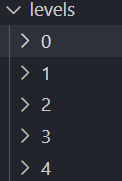
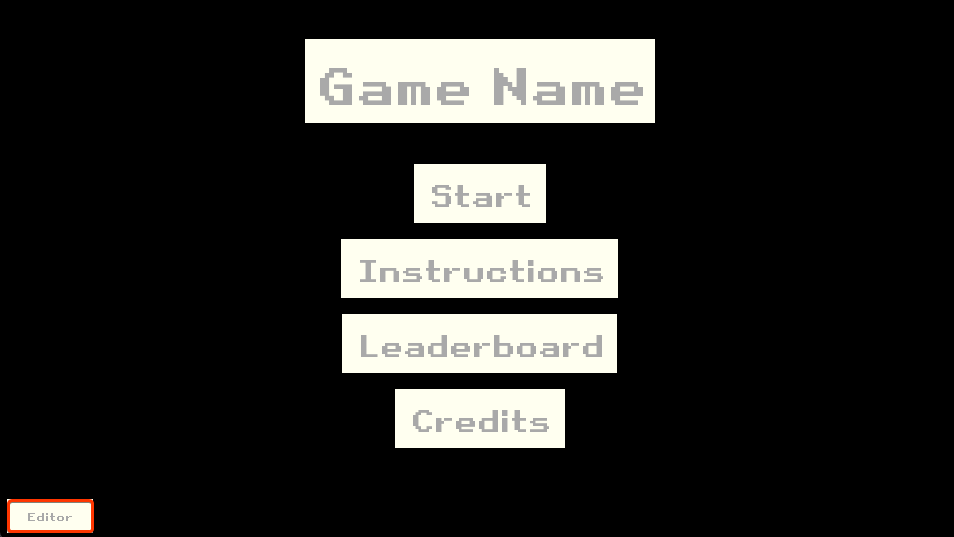
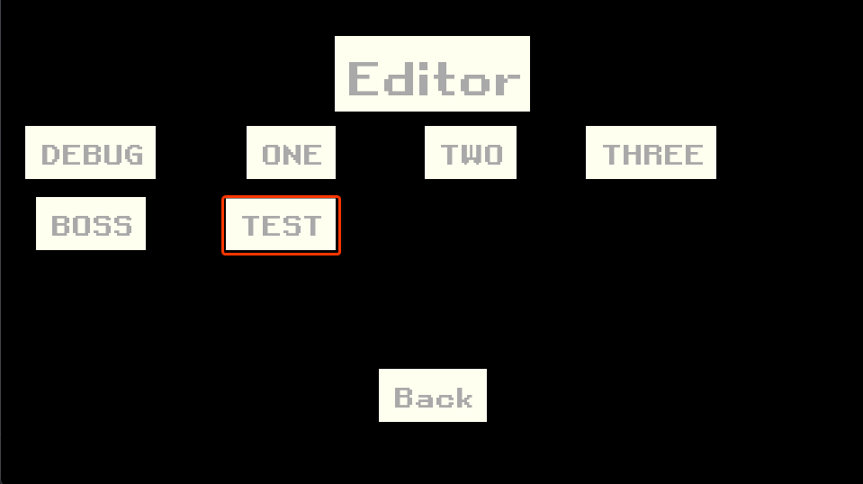
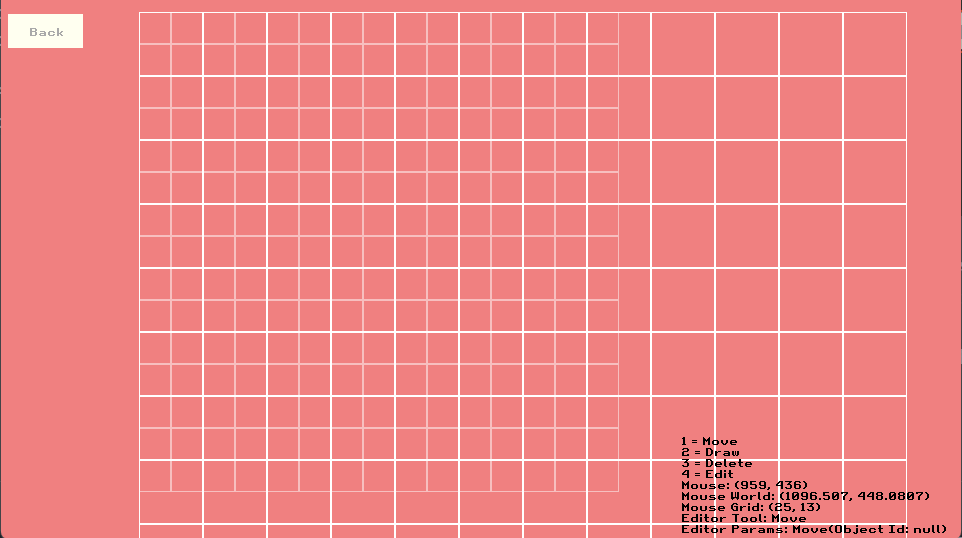

# HOW TO CREATE A LEVEL

Make a new folder with the level number

STEP 1: Create a new folder with the proper ordering in [Assets/levels/](../../Assets/levels/)

The levels are in the order of the numbers, so ensure that you place your level in the right place.



To include data from the file `new-data.json`, you can copy over the [file](new-data.json) into your new folder

```json
// new-data.json
{
    "Name": "SAMPLE LEVEL",
    "Width": WIDTH,
    "Height": HEIGHT,
    "Data": []
}
```

You would replace the Name, WIDTH & HEIGHT with your respective grid values as required.

Once finished, upon opening the game, click on Editor in the Bottom Left corner as seen here marked in red:



Then, you'll see this:



In this case, the TEST level is the one I've created for this demo. You'll hopefully see the one with your level name on it.

If everything goes well, upon clicking the level you'll be greeted with the editor:



You may proceed with creating the level, you can exit at any time. Your changes are saved as you make them.

**You do not have to restart the game in order to play your level, it is automatically loaded into the game when you hit *Back***